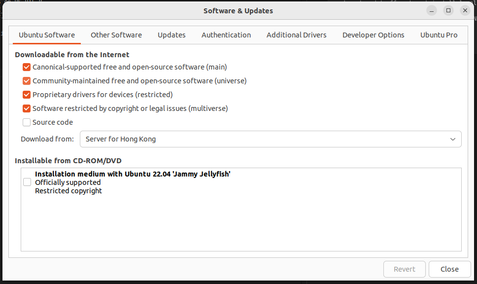

# Download ROS 2 Humble

navigate to https://docs.ros.org/en/humble/Installation/Ubuntu-Install-Debs.html

### Set Locale

```
locale  # check for UTF-8

sudo apt update && sudo apt install locales
sudo locale-gen en_US en_US.UTF-8
sudo update-locale LC_ALL=en_US.UTF-8 LANG=en_US.UTF-8
export LANG=en_US.UTF-8

locale  # verify settings
```

### Setup Sources

First ensure that the Ubuntu Universe repository is enabled.

<div style="text-align: center;">
    
</div>

```
sudo apt install software-properties-common
sudo add-apt-repository universe
```

Now add the ROS 2 GPG key with apt.

```
sudo apt update && sudo apt install curl -y
sudo curl -sSL https://raw.githubusercontent.com/ros/rosdistro/master/ros.key -o /usr/share/keyrings/ros-archive-keyring.gpg
```

Then add the repository to your sources list.

```
echo "deb [arch=$(dpkg --print-architecture) signed-by=/usr/share/keyrings/ros-archive-keyring.gpg] http://packages.ros.org/ros2/ubuntu $(. /etc/os-release && echo $UBUNTU_CODENAME) main" | sudo tee /etc/apt/sources.list.d/ros2.list > /dev/null
```

### Install ROS 2 packages

Update your apt repository caches after setting up the repositories.

```
sudo apt update
```

Desktop Install (Recommended): ROS, RViz, demos, tutorials.

```
sudo apt install ros-humble-desktop
```

Development tools: Compilers and other tools to build ROS packages
```
sudo apt install ros-dev-tools
```

### Environment setup

#### Sourcing the setup script
Set up your environment by sourcing the following file.
```
source /opt/ros/humble/setup.bash
```

### Try some examples

#### Talker-listener

If you installed `ros-humble-desktop` above you can try some examples.

In one terminal, source the setup file and then run a C++ `talker`:

```
source /opt/ros/humble/setup.bash
ros2 run demo_nodes_cpp talker
```

In another terminal source the setup file and then run a Python `listener`:

```
source /opt/ros/humble/setup.bash
ros2 run demo_nodes_py listener
```

You should see the `talker` saying that it’s `Publishing` messages and the `listener` saying `I heard` those messages. This verifies both the C++ and Python APIs are working properly. Hooray!
