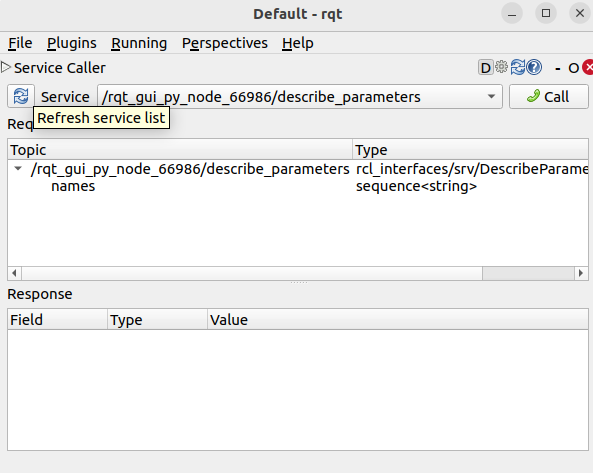
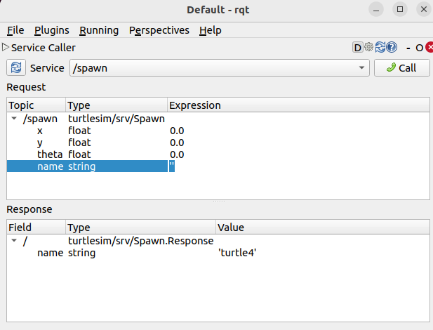

# CLI Tools Document

[Reference](https://docs.ros.org/en/humble/Tutorials/Beginner-CLI-Tools/Configuring-ROS2-Environment.html)

## Configuring environment

[Reference](https://docs.ros.org/en/humble/Tutorials/Beginner-CLI-Tools/Configuring-ROS2-Environment.html#configuring-environment)

### Source the setup files

You will need to run this command on every new shell you open to have access to the ROS 2 commands, like so:

```bash
source /opt/ros/humble/setup.bash
# or below so you don't need to source every time
echo "source /opt/ros/humble/setup.bash" >> ~/.bashrc
```

### Check environment variables

Only after source will these environment variables be set

```bash
printenv | grep -i ROS
```

Check that variables like `ROS_DISTRO` and `ROS_VERSION` are set.

```
ROS_VERSION=2
ROS_PYTHON_VERSION=3
ROS_DISTRO=humble
```

#### The `ROS_DOMAIN_ID` variable

For ROS 2 nodes on the same domain to freely communicate. All ROS 2 notes use domain ID 0 by default. To avoid interference between different groups of computers running ROS 2 on the same network, a different domain ID should be set for each group. Choose a domain ID between 0 and 101, inclusive. For example, `88`

```bash
export ROS_DOMAIN_ID=88
# Or to maintain this setting between shell sessions, add the command to your shell startup script:
echo "export ROS_DOMAIN_ID=88" >> ~/.bashrc
```

#### The `ROS_LOCALHOST_ONLY` variable

`ROS_LOCALHOST_ONLY` allows you to limit ROS 2 communication to localhost only, so that your ROS 2 system, and its topics, services, and actions will not be visible to other computers on the local network.

```bash
export ROS_LOCALHOST_ONLY=1
# Or to maintain this setting between shell sessions, add the command to your shell startup script:
echo "export ROS_LOCALHOST_ONLY=1" >> ~/.bashrc
```

## Using `turtlesim`, `ros2`, and `rpt`

[Reference](https://docs.ros.org/en/humble/Tutorials/Beginner-CLI-Tools/Introducing-Turtlesim/Introducing-Turtlesim.html)

### Concepts

**Turtlesim** is a lightweight simulator for learning ROS 2. It illustrates what ROS 2 does at the most basic level to give you an idea of what you will do with a real robot or a robot simulation later on.

The **ros2 tool** is how the user manages, introspects, and interacts with a ROS system. It supports multiple commands that target different aspects of the system and its operation. One might use it to start a node, set a parameter, listen to a topic, and many more. The **ros2 tool** is part of the core ROS 2 installation.

**rqt** is a graphical user interface (GUI) tool for ROS 2. Everything done in rqt can be done on the command line, but rqt provides a more user-friendly way to manipulate ROS 2 elements.

### Install turtlesim

```bash
sudo apt update
sudo apt install ros-humble-turtlesim
```

Check that the package is installed:

```bash
ros2 pkg executables turtlesim
```

Expected output:

```bash
turtlesim draw_square
turtlesim mimic
turtlesim turtle_teleop_key
turtlesim turtlesim_node
```

### Start turtlesim

```bash
ros2 run turtlesim turtlesim_node
```

What you are expected to see:

<div style="text-align: center;">
    
</div>

```
[INFO] [turtlesim]: Starting turtlesim with node name /turtlesim
[INFO] [turtlesim]: Spawning turtle [turtle1] at x=[5.544445], y=[5.544445], theta=[0.000000]
```

### Use turtlesim

Open another terminal and source ROS 2 again.
```bash
source /opt/ros/humble/setup.bash
```
Run a new node to control the turtle in the first node:
```bash
ros2 run turtlesim turtle_teleop_key
```

You can then use the arrow keys on your keyboard to control the turtle.

**DO NOT CLOSE THE TERMINALS YET for the next section**

### Install rqt

```bash
sudo apt update
sudo apt install '~nros-humble-rqt*'
```

run rqt:
```bash
rqt
```

### Use rqt

select **Plugins** > **Services** > **Service Caller** from the menu bar, you can call different services.

<div style="text-align: center;">
    
</div>

**Plugins** > **Services** > **Service Caller**

#### Try the spawn service

**Select** `/clear` then **Call** can clear the line drawn on turtlesim.

**Select** `/spawn` 

You can double click between the empty single quotes in the Expression column to give value to name, e.g., `Kenny`

<div style="text-align: center;">
    
</div>

You can change `x` and `y` to different value e.g. `1.0` and `1.0` so that the turtle will spawn in different lcoation.

**Click** Call, the turtle will then spawned in the turtlesim window. 

#### Try the set_pen service

Call service `/turtle1/set_pen` and set the pen `color` and `width` then **call** again, the pen color will change.

### Remapping

In order to control `Kenny`. You can remap the `cmd_vel` topic. Create a new terminal, source ROS 2, and run:
```bash
ros2 run turtlesim turtle_teleop_key --ros-args --remap turtle1/cmd_vel:=Kenny/cmd_vel
```

### Close turtlesim

Close the `turtlesim_node` terminal and the `turtle_teleop_key` terminals.

## Understanding nodes

[Reference](https://docs.ros.org/en/humble/Tutorials/Beginner-CLI-Tools/Understanding-ROS2-Nodes/Understanding-ROS2-Nodes.html#understanding-nodes
)

## Understanding topics


## Understanding services


## Understanding parameters


## Understanding actions


## Using `rqt_console` to view logs


## Launching nodes


## Recording and playing back data


