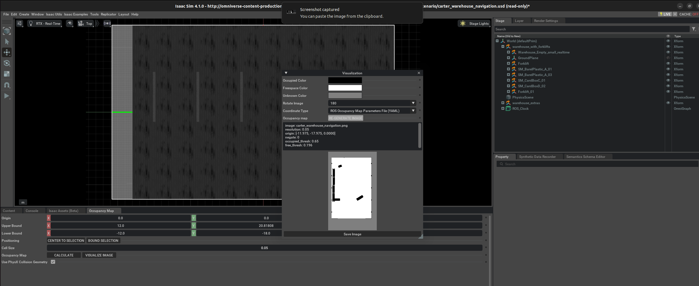

# ROS2 Navigation

[Reference](https://docs.omniverse.nvidia.com/isaacsim/latest/ros2_tutorials/tutorial_ros2_navigation.html)

Install [Nav2](https://docs.nav2.org/getting_started/index.html#installation)

```
sudo apt install ros-humble-navigation2
```

```
sudo apt install ros-humble-nav2-bringup
```

```
sudo apt install ros-humble-turtlebot3-gazebo
```

Running the example:

```
source /opt/ros/humble/setup.bash
export TURTLEBOT3_MODEL=waffle
export GAZEBO_MODEL_PATH=$GAZEBO_MODEL_PATH:/opt/ros/humble/share/turtlebot3_gazebo/models
```

Test installation:

```
ros2 launch nav2_bringup tb3_simulation_launch.py headless:=False
```

Please build isaac ros worksplace following the below instructions.

clone the repo:
```
git clone https://github.com/isaac-sim/IsaacSim-ros_workspaces.
```

Note: ensure you are not in a conda environment `conda deactivate`

Run:
```
sudo apt install python3-rosdep python3-rosinstall python3-rosinstall-generator python3-wstool build-essential

sudo apt install python3-colcon-common-extensions
```

```
cd IsaacSim-ros_workspaces/humble_ws
rosdep install -i --from-path src --rosdistro humble -y
```

Build with:
```
colcon build
```

After build success, you will be able to navigate to the following location:

```
/home/kenny/IsaacSim-ros_workspaces/humble_ws/src/navigation/carter_navigation/maps
```

export ISAAC_ROS_WS='/home/kenny/IsaacSim-ros_workspaces/humble_ws'

This block diagram shows the ROS2 messages required for Nav2:


As described above, the following topics and message types being published to Nav2 in this scenario are:

| ROS2 Topic     | ROS2 Message Type                                                |
|----------------|------------------------------------------------------------------|
| /tf            | tf2_msgs/TFMessage                                               |
| /odom          | nav_msgs/Odometry                                                |
| /map           | nav_msgs/OccupancyGrid                                           |
| /point_cloud   | sensor_msgs/PointCloud                                            |
| /scan          | sensor_msgs/LaserScan (published by an external pointcloud_to_laserscan node) |

**Occupancy Map**

Enable extension: `omni.isaac.occupancy_map`

Go to Isaac Examples -> ROS2 -> Navigation -> Carter Navigation to load the warehouse scenario with the Nova Carter robot.


At the upper left corner of the viewport, click on Camera. Select Top from the dropdown menu.


Go to Isaac Utils -> Occupancy Map.


In the Occupancy Map extension, ensure the Origin is set to X: 0.0, Y: 0.0, Z: 0.0. For the lower bound, set Z: 0.1. For the Upper Bound, set Z: 0.62. Keep in mind, the upper bound Z distance has been set to 0.62 meters to match the vertical distance of the Lidar onboard Carter with respect to the ground.


Select the `warehouse_with_forklifts` prim in the stage. In the Occupancy Map extension, click on **BOUND SELECTION**. The bounds of the occupancy map should be updated to incorporate the selected warehouse_with_forklifts prim. The map parameters should now look similar to the following:


Remove the Nova_Carter_ROS prim from the stage.

Once the setup is complete, click on CALCULATE followed by VISUALIZE IMAGE. A Visualization popup will appear.


For Rotate Image, select 180 degrees and for Coordinate Type select ROS Occupancy Map Parameters File (YAML). Click RE-GENERATE IMAGE. The ROS camera and Isaac Sim camera have different coordinates.



Occupancy map parameters formatted to YAML appears in the field below. Copy the full text.

```
image: carter_warehouse_navigation.png
resolution: 0.05
origin: [-11.975, -17.975, 0.0000]
negate: 0
occupied_thresh: 0.65
free_thresh: 0.196
```


Create a YAML file for the occupancy map parameters called `carter_warehouse_navigation.yaml` and place it in the `maps` directory, which is located in the sample `carter_navigation` ROS2 package (`/home/kenny/IsaacSim-ros_workspaces/humble_ws/src/navigation/carter_navigation/maps/carter_warehouse_navigation.yaml`).

Specifically, copy and paste the previous parameters to the yaml file you just created:

```
image: carter_warehouse_navigation.png
resolution: 0.05
origin: [-11.975, -17.975, 0.0000]
negate: 0
occupied_thresh: 0.65
free_thresh: 0.196
```

Insert the previously copied text in the `carter_warehouse_navigation.yaml` file.

Back in the visualization tab in Omniverse Isaac Sim, click **Save Image**. Name the image as `carter_warehouse_navigation.png` and choose to save it in the same directory as the map parameters file.

An occupancy map is now ready to be used with Nav2!

## Running Nav2

### Nav2 with Nova Carter in Small Warehouse

Go to Isaac Examples -> ROS2 -> Navigation -> Carter Navigation to load the warehouse scenario with the Nova Carter robot.

Click on Play to begin simulation.

In a new terminal, run the ROS2 launch file to begin Nav2.

locate to humble_ws
```
cd /home/kenny/IsaacSim-ros_workspaces/humble_ws
source install/local_setup.bash
```
next run:
```
ros2 launch carter_navigation carter_navigation.launch.py
```


Since the position of the robot is defined in the parameter file carter_navigation_params.yaml, the robot should already be properly localized. If required, the 2D Pose Estimate button can be used to re-set the position of the robot.

Click on the Navigation2 Goal button and then click and drag at the desired location point in the map. Nav2 now generates a trajectory and the robot starts moving towards its destination!

**Using the Nova Cater Description Package**

[Using the Nova Cater Description Package](https://docs.omniverse.nvidia.com/isaacsim/latest/ros2_tutorials/tutorial_ros2_navigation.html#using-the-nova-carter-description-package-optional)

(Optional) You can add the Isaac ROS Nova Carter robot description by setting up and building the package. Follow the Using the Nova Carter Description Package (Optional) section to learn more.

```
cd /home/kenny/IsaacSim-ros_workspaces/humble_ws/src
git clone -b release-3.1 https://github.com/NVIDIA-ISAAC-ROS/isaac_ros_common.git isaac_ros_common
git clone --recursive -b release-3.1 https://github.com/NVIDIA-ISAAC-ROS/nova_carter.git nova_carter
```
Create a file called `.isaac_ros_common-config` with the following context:

```
cd ${ISAAC_ROS_WS}/src/isaac_ros_common/scripts
echo -e "CONFIG_IMAGE_KEY=ros2_humble.nova_carter\nCONFIG_DOCKER_SEARCH_DIRS=(../../nova_carter/docker ../docker)" > .isaac_ros_common-config
```

Launch the Docker container using the `run_dev.sh` script:

```
cd ${ISAAC_ROS_WS}/src/isaac_ros_common
./scripts/run_dev.sh
```

you may need to add yourself to the docker group first
```
sudo usermod -aG docker kenny
newgrp docker
```

Clone the dependency repositories using the `vcstool` file in the `nova_carter` repository:

```
cd /workspaces/isaac_ros-dev
vcs import --recursive src < src/nova_carter/nova_carter.repos
```

In a new terminal navigate to the folder containing launch files in the nova_carter_description package and create a new file called `nova_carter_description_isaac_sim.launch.py`. Specifically, enter the following command:

```
cd ${ISAAC_ROS_WS}/src/nova_carter/nova_carter_description/launch
gedit nova_carter_description_isaac_sim.launch.py
```

Copy the following snippet into the new file and save.

```py
# SPDX-FileCopyrightText: NVIDIA CORPORATION & AFFILIATES
# Copyright (c) 2024 NVIDIA CORPORATION & AFFILIATES. All rights reserved.
#
# Licensed under the Apache License, Version 2.0 (the "License");
# you may not use this file except in compliance with the License.
# You may obtain a copy of the License at
#
# http://www.apache.org/licenses/LICENSE-2.0
#
# Unless required by applicable law or agreed to in writing, software
# distributed under the License is distributed on an "AS IS" BASIS,
# WITHOUT WARRANTIES OR CONDITIONS OF ANY KIND, either express or implied.
# See the License for the specific language governing permissions and
# limitations under the License.
#
# SPDX-License-Identifier: Apache-2.0

# flake8: noqa: F403,F405
import isaac_ros_launch_utils as lu
from isaac_ros_launch_utils.all_types import *
from launch import LaunchDescription
from launch_ros.actions import Node


def generate_launch_description() -> LaunchDescription:
    args = lu.ArgumentContainer()
    args.add_arg('calibrated_urdf_file', default='/etc/nova/calibration/isaac_calibration.urdf')

    return LaunchDescription([
        lu.add_robot_description(nominals_package='nova_carter_description',
                                nominals_file='urdf/nova_carter.urdf.xacro',
                                robot_calibration_path=args.calibrated_urdf_file),
    ])
```

Inside the Docker container build all the dependencies for nova_carter_description package.

```
cd /workspaces/isaac_ros-dev
colcon build --packages-up-to nova_carter_description
```

In the Docker container source the isaac_ros-dev workspace and run the custom launch file that you just created above to start publishing the robot description to the `/robot_descritption topic`.

```
source /workspaces/isaac_ros-dev/install/setup.bash
ros2 launch nova_carter_description nova_carter_description_isaac_sim.launch.py
```

Outside of the container (on the host), open a new terminal and ensure ROS is installed and that the **Isaac Sim Workspace** is sourced. Additionally, source the `nova_carter_description` package workspace in a new terminal. Then, run the ~carter_navigation~ launch file

```
source ${ISAAC_ROS_WS}/install/setup.bash
ros2 launch carter_navigation carter_navigation.launch.py
```

The robot model is automatically loaded in the scene in Rviz.

If want to replace a occupancy map:

use `docker ps` to check docker id. e.g., a2e2bd586226

```
docker cp $ISAAC_ROS_WS/src/navigation/carter_navigation/maps/carter_warehouse_navigation.png a2e2bd586226:/workspaces/isaac_ros-dev/src/navigation/carter_navigation/maps/carter_warehouse_navigation.png
```


Sending Goals Programmatically:

The isaac_ros_navigation_goal ROS2 package can be used to set goal poses for the robot using a python node. It is able to randomly generate and send goal poses to Nav2. It is also able to send user-defined goal poses if needed.


Others:


[More packages](https://docs.omniverse.nvidia.com/isaacsim/latest/installation/install_ros.html#included-ros-packages)


[Nav2 with iw.hub in Warehouse](https://docs.omniverse.nvidia.com/isaacsim/latest/ros2_tutorials/tutorial_ros2_navigation.html#nav2-with-iw-hub-in-warehouse)

## Next Step


## Previous Step

[ROS 2 Quality of Service (QoS)](10_doc.md)