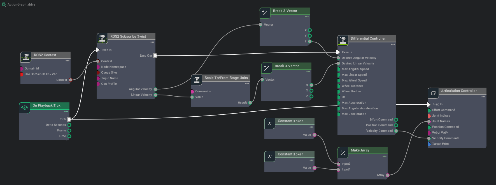

# Driving TurtleBot via ROS2 messages

[Reference](https://docs.omniverse.nvidia.com/isaacsim/latest/ros2_tutorials/tutorial_ros2_drive_turtlebot.html#isaac-sim-app-tutorial-ros2-drive-turtlebot)


## Driving the Robot

At the end of [URDF Import](2_doc.md), the turtle robot has drivable joints, and when given a target position or velocity, it can move the joints to match the targets. However, in most cases, you want to be controlling the vehicle speed and not the individual wheel speed. Therefore we first want to add the appropriate controllers. In the case of Turtlebot3, a wheeled-robot with two wheels, the nodes needed are `Differential Controller` and `Articulation Controller`. `The Differential Controller` node convert vehicle speed to wheel speed, and `Articulation Controller` node send the commands to the joint drives.

Detailed instructions on how to connect these nodes can be found in [OmniGraph](https://docs.omniverse.nvidia.com/isaacsim/latest/gui_tutorials/tutorial_gui_omnigraph.html#isaac-sim-app-tutorial-gui-omnigraph) for a similar robot (NVIDIA Jetbot), so we won’t go into details here.

## Connecting to ROS2

As part of our ROS2 bridge, we provide nodes that are subscribers and publisher of specific messages, some utility nodes such as keeping track of simulation time and context ID. You will also find “Helper Nodes”, which are gateways to more complex Omnigraphs that we abstract away from users.

To establish a ROS2 bridge for a specific topic, the steps can be generalized to the following:
- open an action graph
- add the OG nodes relevant to the desired ROS 2 topics
- modify any properties as needed
- connect the data pipeline

The ROS2 publisher nodes are where Omniverse Isaac Sim data gets packaged into ROS message and sent out to the ROS network, and subscriber nodes are where ROS2 messages are received and allocated to the corresponding Omniverse Isaac Sim parameters. So to use them, we simply have to pipe in and out the necessary data, as directed by the properties of each node. If you need to publish or subscribe to messages beyond the ones we provided, checkout Omnigraph: [Custom Python Nodes](https://docs.omniverse.nvidia.com/isaacsim/latest/advanced_tutorials/tutorial_advanced_omnigraph_custom_python_nodes.html#isaac-sim-app-tutorial-advanced-omnigraph-custom-python-nodes), or [Omnigraph: Custom C++ Nodes](https://docs.omniverse.nvidia.com/isaacsim/latest/advanced_tutorials/tutorial_advanced_omnigraph_custom_cpp_nodes.html#isaac-sim-app-tutorial-advanced-omnigraph-custom-cpp-nodes) for ways to integrate custom omnigraph nodes.

## Putting it Together

### Building the Graph

1. Open Visual Scripting: Window > Visual Scripting > Action Graph. An Action Graph window will appear on the bottom, you can dock it wherever that’s convenient.

2. Click on the New Action Graph Icon in middle of the Action Graph Window.

3. Inside the Action Graph window, there is a panel on the left hand side with all the OmniGraph Nodes (or OG nodes). All ROS2 related OG nodes are listed under Isaac Ros2. You can also search for nodes by name. To place node into the graph, simply drag it from the node list into the graph window. If all the ROS related nodes are labeled Ros1 not Ros2, it means you have ROS bridge enabled and not ROS2. Go to Windows > Extensions to disable ROS bridge and enabled ROS2 bridge.

4. Build a graph that matches the one below.



### Graph Explained

1. **On Playback Tick Node**: Producing a tick when simulation is “Playing”. Nodes that receives ticks from this node will execute their compute functions every simulation step.

2. **ROS2 Context Node**: ROS2 uses DDS for its middleware communication. DDS uses Domain ID to allow for different logical networks operate independently even though they share a physical network. ROS 2 nodes on the same domain can freely discover and send messages to each other, while ROS 2 nodes on different domains cannot. ROS2 context node creates a context with a given Domain ID. It is set to 0 by default. If Use Domain ID Env Var is checked, it will import the `ROS_DOMAIN_ID` from the environment in which you launched the current instance of Isaac Sim.

3. **ROS2 Subscribe Twist Node**: Subscribing to a Twist message. Specify the Ros Topic’s name `/cmd_vel` in the topicName field in its Property Tab.
    ```
    Note the subscriber nodes often have a Exec Out field. This act similar to a tick and will send a signal when a message is received by the subscriber. In this case, we want to only calculate the differential commands when a new twist message arrives. Therefore the Differential Node’s Exec In is ticked by the output of the subscriber node and not by On Playback Tick.
    ```
4. **Scale To/From Stage Unit Node**: Convert assets or inputs to stage unit.

5. **Break 3-Vector Node**: The output of the Twist subscriber node is linear and angular velocities, both **3-dimensional vectors**. But the input of the **differential controller node** only takes a **forward velocity** and **rotation velocity** in **z-axis**, therefore we need to decompose the array and extract the corresponding elements before feeding them into the differential controller node.

6. **Differential Controller Node**: This node receives **desired vehicle speed** and calculates the **wheel speed** of the robot. It needs the **wheel radius** and **distance between the wheels** to make that calculation. It can also receive **optional speed limit parameters** to cap off wheel speed. Type in the **property** tab the **wheel radius**, the **distance between the wheels**, and the **maximum linear speed** for the vehicle as seen in table below to match the Turtlebot.

    | Field            |Value  |
    |------------------| ------|
    | Max Linear Speed | 0.22  |
    | Wheel Distance   | 0.16  |
    | Wheel Radius     | 0.025 |
	
7. **Articulation Controller Node**: This node is assigned to a target robot, then takes in the names or the indices of the joints that needs to be moved, and move them by the commands given in either *Position Commands*, *Velocity Commands*, or *Effort Commands*.
    
    - Note the Articulation Controller node is ticked by On Playback Tick. So that if no new Twist message arrives, it will continue to execute whatever command it had received before.
    - To assign the Articulation Controller node’s target to be the Turtlebot. In the property tab, click on Add Target and search for the Turtlebot prim in the popup box. Make sure the robot prim you select is also where the Articulation Root API is applied. Sometimes it is the robot’s parent prim. But often times for mobile robots, it is the chassis prim instead. If you used the URDF importer following our previous tutorial, the Articulation Root API can be found on `/World/turtlebot3_burger/base_footprint`. More about Articulation API can be found in Add Articulation. **If the articulation root is set on the base_footprint prim, remove the articulation root property from `/World/turtlebot3_burger/base_footprint` and add the articulation root property on the main robot prim of `/World/turtlebot3_burger`.**
    - To put the names of the wheel joints in an array format, type in the names of the wheel joints inside each of the **Constant Token** nodes, and feed the array of the names into the Make Array Node. The names of the joints for the Turtlebot are wheel_left_joint and wheel_right_joint.
    - If you are wondering why not put the names in Constant String node, it’s because OmniGraph does not have string-array data type, therefore if strings needed to be put in an array format to be used by a node, it needs to be token type instead.

## Vertify ROS connections

Click `Play`, and then in a separate ROS-sourced terminal, enter `ros2 topic list`. `/cmd_vel` should be listed in addition to `/parameter_events` and `/rosout`

on the terminal, enter command: `ros2 topic pub /cmd_vel geometry_msgs/Twist "{'linear': {'x': 0.2, 'y': 0.0, 'z': 0.0}, 'angular': {'x': 0.0, 'y': 0.0, 'z': 0.0}}"` to drive it forward.

Enter command `ros2 topic pub /cmd_vel geometry_msgs/Twist "{'linear': {'x': 0.0, 'y': 0.0, 'z': 0.0}, 'angular': {'x': 0.0, 'y': 0.0, 'z': 0.0}}"` to stop it from moving.

To make it easier for us to move the Turtlebot around, install the `teleop_twist_keyboard` by running the following command: `sudo apt-get install ros-humble-teleop-twist-keyboard`

Enable driving using the keyboard by running: `ros2 run teleop_twist_keyboard teleop_twist_keyboard`

Please see vid/1.webm for demo.

## Next Step

[ROS2 Cameras](4_doc.md)

## Previous Step

[URDF Import: Turtlebot](2_doc.md)