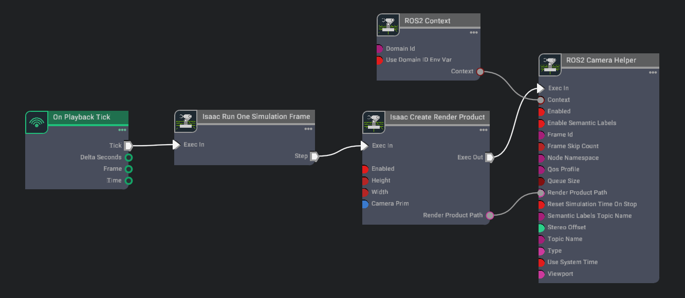
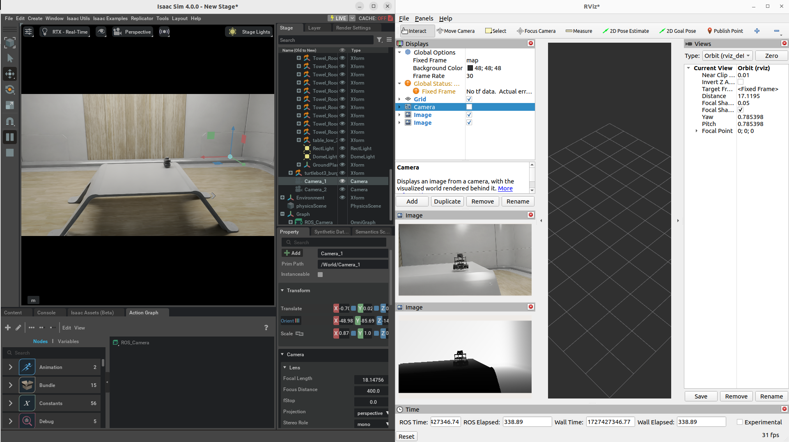

# ROS 2 Cameras

[Reference](https://docs.omniverse.nvidia.com/isaacsim/latest/ros2_tutorials/tutorial_ros2_camera.html)

## Camera Publisher

### Setting Up Cameras

Add two cameras named `Camera_1` and `Camera_2`: in Isaac Sim select from tab **Create** > **Camera**, rename the cameras byy right-clicking them on the right panel.

Build an Action Graph as below:

Parameters:

| Node                      | Input Field | Value          |
|---------------------------|-------------|----------------|
|Isaac Create Render Product| CameraPrim  | /World/Camera_1|
|                           | enabled     | True           |
|ROS2 Camera Helper         | type        | rgb            |
|                           | topicName   | rgb            |
|                           | frameId     | turtle         |

### Graph Explained

1. **On Playback Tick Node**: Producing a tick when simulation is “Playing”. Nodes that receives ticks from this node will execute their compute functions every simulation step.

2. **ROS2 Context Node**: ROS2 uses DDS for its middleware communication. DDS uses Domain ID to allow for different logical networks operate independently even though they share a physical network. ROS 2 nodes on the same domain can freely discover and send messages to each other, while ROS 2 nodes on different domains cannot. ROS2 context node creates a context with a given Domain ID. It is set to 0 by default. If Use Domain ID Env Var is checked, it will import the `ROS_DOMAIN_ID` from the environment in which you launched the current instance of Isaac Sim.

3. **Isaac Create Render Product**: Creating a render product prim which acquires the rendered data from the given camera prim and outputs the path to the render product prim. Rendering can be enabled/disabled on command by checking/unchecking the enabled field.

4. **Isaac Run One Simulation Frame**: This node will make sure the pipeline is only ran once on start.

5. **ROS2 Camera Helper**: Indicating which type of data to publish, and which rostopic to publish it on.

### Camera Helper Node

The *Camera Helper* Node is abstracting a complex postprocessing network from the users. Once you press Play with a Camera Helper Node connected, you may see that in the list of Action Graphs when you click on the icon on the upper left corner of the Action Graph window, a new one appears: `/Render/PostProcessing/SDGPipeline`. This graph is automatically created by the Camera Helper Node. The pipeline retrieves relevant data from the renderer, process it, and send them to the corresponding ROS publisher. This graph is only created in the session you are running. It will not be saved as part of your asset and will not appear in the Stage tree.

## Depth and other Perception Ground Truth data

In addition to RGB image, the following synthetic sensor and perceptual information also are available for any camera. To see the units used for each synthetic data annotator refer to [omni.replicator](https://docs.omniverse.nvidia.com/extensions/latest/ext_replicator/annotators_details.html).

- Depth
- Point Cloud

Before publishing the following bounding box and labels please look at the Isaac Sim Replicator Tutorials to learn about semantically annotating scenes first.

- BoundingBox 2D Tight
- BoundingBox 2D Loose
- BoundingBox 3D
- Semantic labels
- Instance Labels

An example of publishing multiple Rostopics for multiple cameras can be found in the asset `Isaac/Samples/ROS2/Scenario/turtlebot_tutorial.usd`

### Camera info Helper Node

The Camera Info Helper publisher node uses the following equations to calculate the K, P, R camera intrinsic matrices.

**Parameter calculations:**

- fx = width * focalLength / horizontalAperture
- fy = height * focalLength / verticalAperture
- cx = width * 0.5
- cy = height * 0.5

**K Matrix (Matrix of intrinsic parameters)**

The K matrix is a 3x3 matrix.

- K = { fx, 0, cx 0, fy, cy 0, 0, 1 }

**P Matrix (Projection Matrix)**

For stereo cameras the stereo offset of the second camera with respect to the first camera in x and y are denoted as Tx and Ty. These values are computed automatically if two render products are attached to the node.

For monocular cameras Tx = Ty = 0.

The P matrix is a 3x4 row-major matrix.

P = { fx, 0, cx, Tx, 0, fy, cy, Ty, 0, 0, 1, 0 }

**R Matrix (Rectification Matrix)**

The R matrix is a rotation matrix applied to align the camera coordinate system with the ideal stereo image plane, ensuring that epipolar lines in both stereo images become parallel. The R matrix is only used for stereo cameras and is set as a 3x3 matrix.

### Graph Shortcut

We provide a menu shortcut to build multiple camera sensor graphs with just a few clicks. Go to **Isaac Utils** > **Common Omnigraphs** > **ROS2 Camera**. (If you don’t see any ROS2 graphs listed, you need to first enable the ROS2 bridge). A popup box below will appear asking for the parameters needed to populate the graphs. You must provide the Graph Path, the Camera Prim, frameId, any Node Namespaces if you have one, and check the boxes for the data you wish to publish. If you wish to add the graphs to an existing graph, check the “Add to an existing graph?” box. This will append the nodes to the existing graph, and use the existing tick node, context node, and simulation time node if they exist.

### Verify ROS connection

Use `ros2 topic echo /depth` to see the raw information that is being passed along

In a ROS2-sourced terminal, type in the command `rviz2` in the GUI, click **Add** > **By topic** > **Image** under `/rgb` or `/depth`.

## Next Step

Checkout [Publishing Camera’s Data](5_doc.md) to learn how to publish camera’s data through Python scripting.

[ROS2 Clock](6_doc.md) to learn to setup ROS2 Clock publishers and subscribers with Omniverse Isaac Sim.

## Previous Step

[Driving TurtleBot via ROS2 messages](3_doc.md)