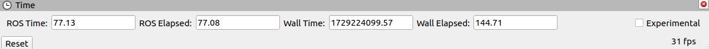
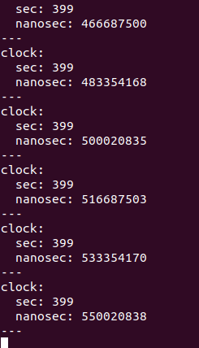
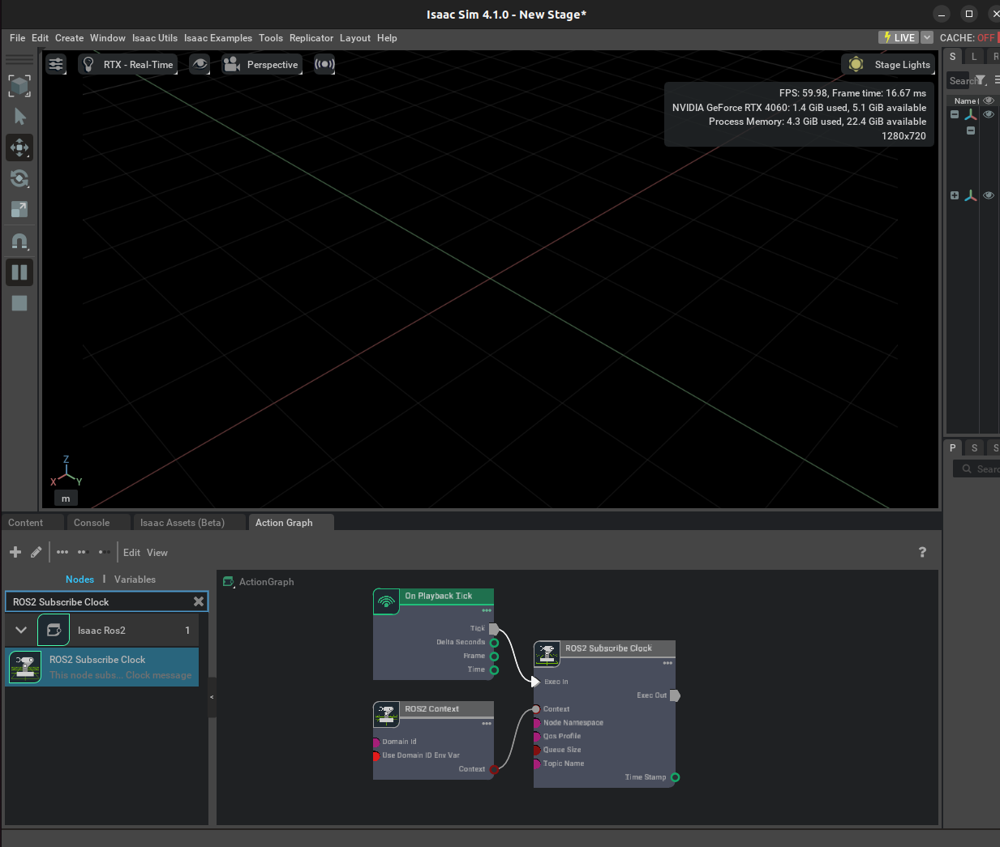

# ROS2 Clock

[Reference](https://docs.omniverse.nvidia.com/isaacsim/latest/ros2_tutorials/tutorial_ros2_clock.html)

In order for external ROS2 nodes to synchronize with simulation time, a clock topic is usually used. Many ROS2 nodes such as RViz2 use the parameter use_sim_time which if set to True will indicate to the node to begin subscribing to the /clock topic and synchronizing to the published simulation time.

You can either set this parameter in a ROS2 launch file or set the parameter using the following command in a new ROS2-sourced terminal:

```
ros2 param set /node_name use_sim_time true
```

Make sure to replace /node_name with whatever node you are currently running. If setting using the terminal, the node must already be running first before setting the parameter.


Start RViz in a new ROS2-sourced terminal.

```
ros2 run rviz2 rviz2
```

In a new ROS2-sourced terminal set the use_sim_time parameter to true for the RViz node. Ensure that simulation is stopped in Isaac Sim.

```
ros2 param set /rviz use_sim_time true
```

In Isaac Sim click Play.

In RViz, the ROS Time is now identical to the simulation time published from Isaac Sim over the /clock topic.



```
ros2 topic echo /clock
```




Camera Helper and RTX Lidar nodes

You have already seen the ROS2 Camera Helper node in a previous tutorial and you will see the ROS2 RTX Lidar Helper node in a following tutorial. As both of these nodes automatically generate a sensor publishing pipeline, to use system timestamps for their publishers, ensure that their `useSystemTime` input is set to True.

Now try:

1.



2

```
ros2 topic pub -t 1 /clock rosgraph_msgs/Clock "clock: {sec: 1, nanosec: 200000000 }"
```

The timeStamp value in the ROS2 Subscribe Clock OmniGraph node should change to 1.2.

Change the previous command with different sec and nanosec values to see those values being reflected in the timeStamp field of the ROS2 Subscribe Clock OmniGraph node.

We provide a menu shortcut to build a clock graph within just a few clicks. Go to Isaac Utils > Common Omnigraphs > ROS2 Clock. (If you don’t see any ROS2 graphs listed, you need to first enable the ROS2 bridge). A popup box will appear asking for the parameters needed to populate the graphs. Provide the graph path and click “OK”, a graph publishing the simulated clock should appear on the stage.

## Next Step

[RTX Lidar Sensors](7_doc.md)

## Previous Step

[Publishing Camera’s Data](5_doc.md)

[ROS 2 Cameras](4_doc.md)