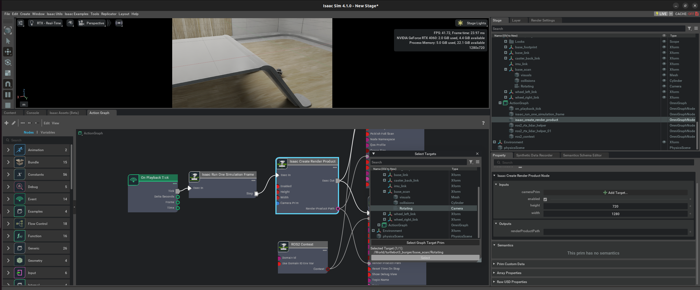
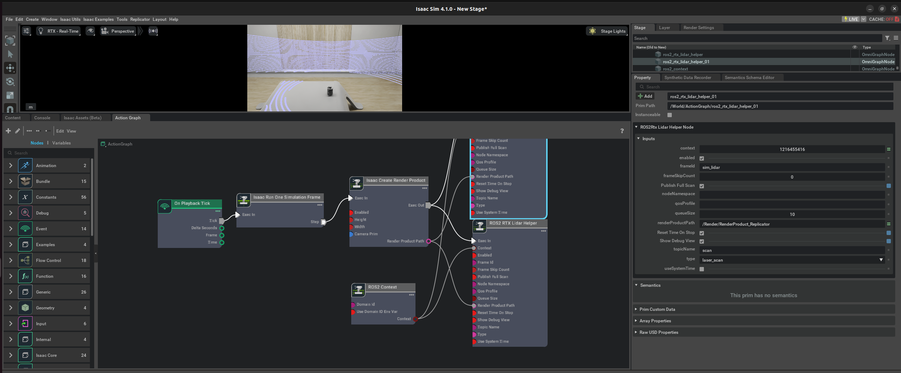
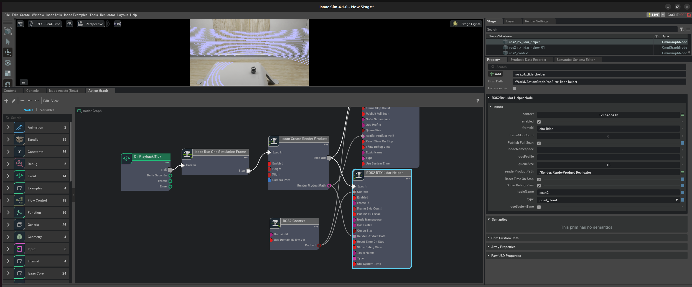
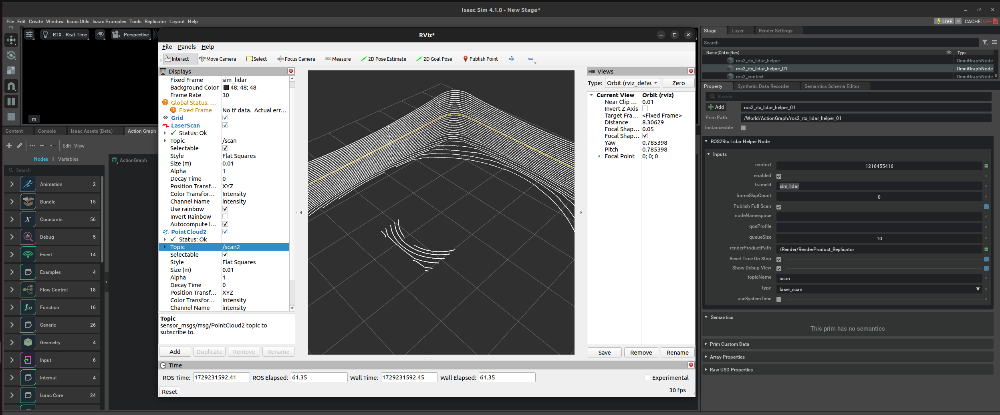
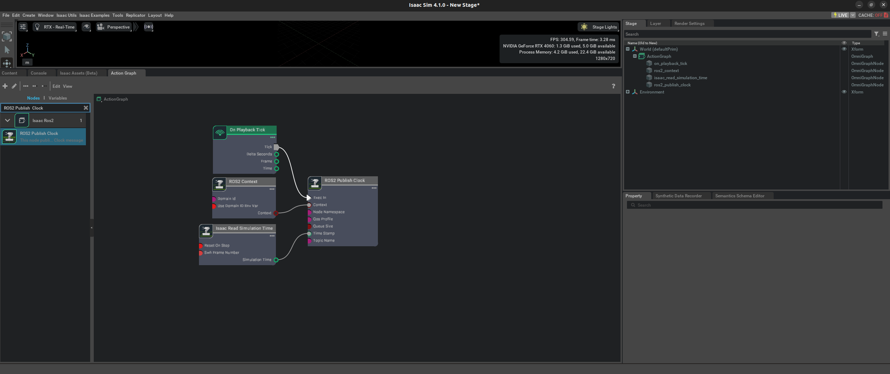

# RTX Lidar Sensors

[Reference](https://docs.omniverse.nvidia.com/isaacsim/latest/ros2_tutorials/tutorial_ros2_rtx_lidar.html)

First we need to add a Lidar sensor to the robot. Go to Create -> Isaac -> Sensors -> RTX Lidar -> Rotating.

import turtlebot and simple room based on this [tutorial](2_doc.md)

drag the Lidar prim under /World/turtlebot3_burger/base_scan. Zero out any displacement in the Transform fields inside the Property tab. The Lidar prim should now be overlapping with the scanning unit of the robot.


- **On Playback Tick**: This is the node responsible for triggering all the other nodes once Play is pressed.

- **ROS2 Context Node**: ROS2 uses DDS for its middleware communication. DDS uses Domain ID to allow for different logical networks operate independently even though they share a physical network. ROS 2 nodes on the same domain can freely discover and send messages to each other, while ROS 2 nodes on different domains cannot. ROS2 context node creates a context with a given Domain ID. It is set to 0 by default. If Use Domain ID Env Var is checked, it will import the `ROS_DOMAIN_ID` from the environment in which you launched the current instance of Isaac Sim.

- **Isaac Run One Simulation Frame**: This is the node to running the create render product pipeline once at the start to improve performance.

- **Isaac Create Render Product**: In the input camera target prim select the RTX Lidar created in step 2.

- **ROS2 RTX Lidar Helper**: This node will handle publishing of the laser scan message from the RTX Lidar. The input render product is obtained from the output of Isaac Create Render Product in step b.

- If you wish to also publish point cloud data, add another ROS2 RTX Lidar Helper node, and under input type select `point_cloud` and change the topic name to point_cloud. This node will handle publishing the point cloud from the RTX Lidar. The input render product is obtained from the output of Isaac Create Render Product in step b.






For RViZ visualization:



- Run RViZ2 (`rviz2`) in a sourced terminal.

- `ros2 param set /rviz use_sim_time true`

- The fixed frame name in Isaac Sim for the RTX Lidar is set to sim_lidar, update the Rviz side accordingly.

- Add LaserScan visualization and set topic to /scan

- Add PointCloud2 visualization and set topic to /point_cloud

## Running example

in a new terminal:

```
rviz2 -d humble_ws/src/isaac_tutorials/rviz2/rtx_lidar.rviz
```

Run the sample script:
Open vscode from extension manager in isaac-sim and run in the right path
```
./python.sh standalone_examples/api/omni.isaac.ros2_bridge/rtx_lidar.py
```

The script:
```py
# Copyright (c) 2020-2023, NVIDIA CORPORATION. All rights reserved.
#
# NVIDIA CORPORATION and its licensors retain all intellectual property
# and proprietary rights in and to this software, related documentation
# and any modifications thereto. Any use, reproduction, disclosure or
# distribution of this software and related documentation without an express
# license agreement from NVIDIA CORPORATION is strictly prohibited.
#

import sys

from isaacsim import SimulationApp

# Example for creating a RTX lidar sensor and publishing PointCloud2 data
simulation_app = SimulationApp({"headless": False})
import carb
import omni
import omni.kit.viewport.utility
import omni.replicator.core as rep
from omni.isaac.core import SimulationContext
from omni.isaac.core.utils import stage
from omni.isaac.core.utils.extensions import enable_extension
from omni.isaac.nucleus import get_assets_root_path
from pxr import Gf

# enable ROS2 bridge extension
enable_extension("omni.isaac.ros2_bridge")

simulation_app.update()


# Locate Isaac Sim assets folder to load environment and robot stages
assets_root_path = get_assets_root_path()
if assets_root_path is None:
    carb.log_error("Could not find Isaac Sim assets folder")
    simulation_app.close()
    sys.exit()

simulation_app.update()
# Loading the simple_room environment
stage.add_reference_to_stage(
    assets_root_path + "/Isaac/Environments/Simple_Warehouse/full_warehouse.usd", "/background"
)
simulation_app.update()

# Create the lidar sensor that generates data into "RtxSensorCpu"
# Sensor needs to be rotated 90 degrees about X so that its Z up

# Possible options are Example_Rotary and Example_Solid_State
# drive sim applies 0.5,-0.5,-0.5,w(-0.5), we have to apply the reverse
_, sensor = omni.kit.commands.execute(
    "IsaacSensorCreateRtxLidar",
    path="/sensor",
    parent=None,
    config="Example_Rotary",
    translation=(0, 0, 1.0),
    orientation=Gf.Quatd(1.0, 0.0, 0.0, 0.0),  # Gf.Quatd is w,i,j,k
)

# RTX sensors are cameras and must be assigned to their own render product
hydra_texture = rep.create.render_product(sensor.GetPath(), [1, 1], name="Isaac")

simulation_context = SimulationContext(physics_dt=1.0 / 60.0, rendering_dt=1.0 / 60.0, stage_units_in_meters=1.0)
simulation_app.update()

# Create Point cloud publisher pipeline in the post process graph
writer = rep.writers.get("RtxLidar" + "ROS2PublishPointCloud")
writer.initialize(topicName="point_cloud", frameId="sim_lidar")
writer.attach([hydra_texture])

# Create the debug draw pipeline in the post process graph
writer = rep.writers.get("RtxLidar" + "DebugDrawPointCloud")
writer.attach([hydra_texture])


# Create LaserScan publisher pipeline in the post process graph
writer = rep.writers.get("RtxLidar" + "ROS2PublishLaserScan")
writer.initialize(topicName="scan", frameId="sim_lidar")
writer.attach([hydra_texture])

simulation_app.update()

simulation_context.play()

while simulation_app.is_running():
    simulation_app.update()

# cleanup and shutdown
simulation_context.stop()
simulation_app.close()
```

## Multiple Sensors in RViz2

### Simulation Timestamp

Use **Isaac Read Simulation Time** as the node that feeds the timestamp into all of the publishing nodes’ timestamps.

**ROS clock**

To publish the simulation time to the ROS clock topic, you can setup the graph as shown in the Running ROS 2 [Clock Publisher tutorial](6_doc.md).



**frameId and topicName**

To visualize all the sensors as well as the tf tree all at once inside RViz, the frameId and topicNames must follow a certain convention in order for Rviz to recognize them all at once. The table below roughly describes these conventions. To see the multi-sensor example below, consult the USD asset `Isaac/Samples/ROS2/Scenario/turtlebot_tutorial.usd`.

| Source        | frameId                    | nodeNamespace               | topicName      | type       |
|---------------|----------------------------|-----------------------------|----------------|------------|
| Camera RGB    | (device_name):(data_type)  | (device_name)/(data_type)   | image_raw      | rgb        |
| Camera Depth  | (device_name):(data_type)  | (device_name)/(data_type)   | image_rect_raw | depth      |
| Lidar         | world                      |                             | scan           | laser_scan |
| TF            |                            |                             | tf             | tf         |

run:
```
ros2 run rviz2 rviz2 -d humble_ws/src/isaac_tutorials/rviz2/camera_lidar.rviz
```

## Next Step

[ROS2 Transform Trees and Odometry](8_doc.md)

## Previous Step

[ROS2 Clock](6_doc.md)