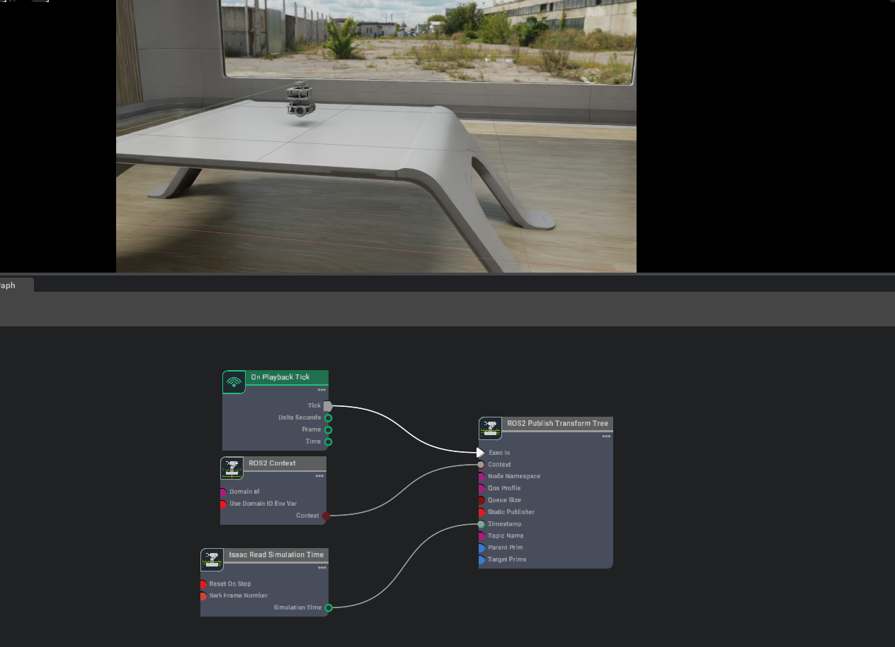
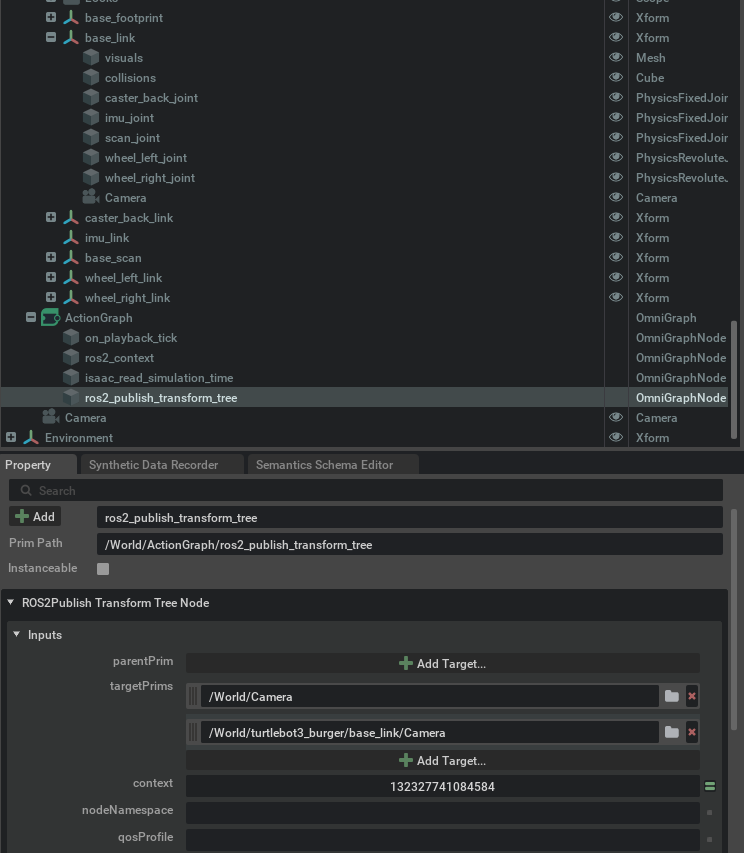
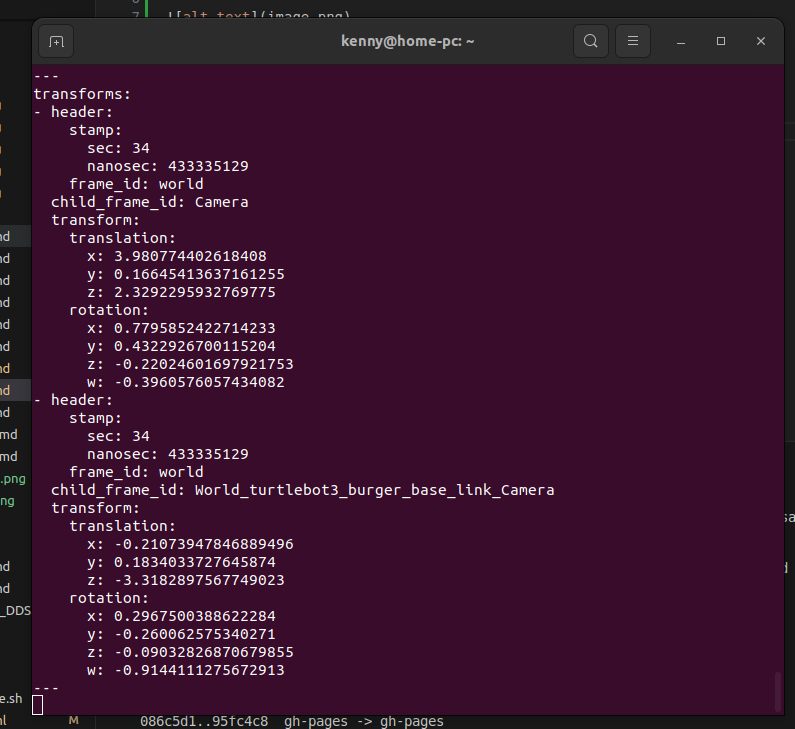
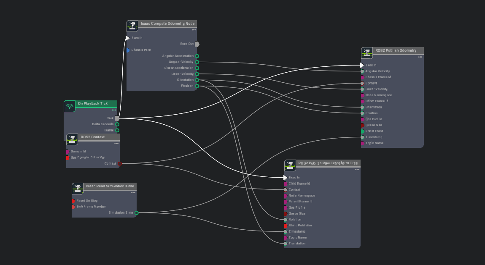
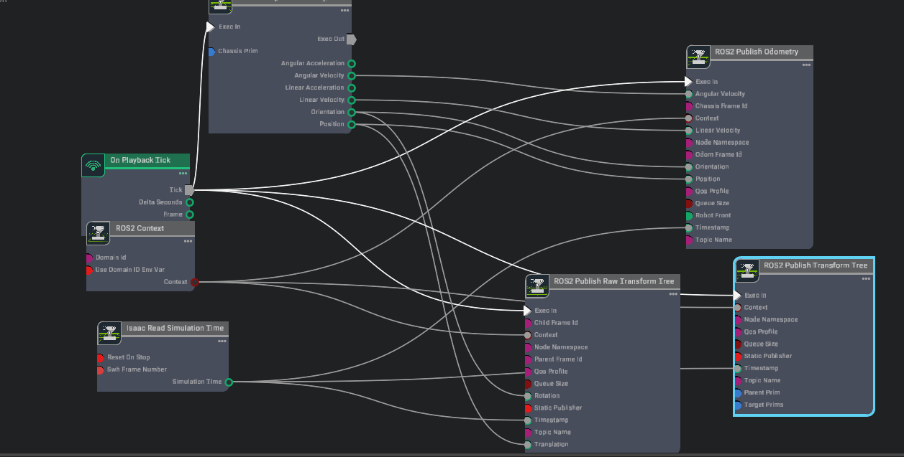
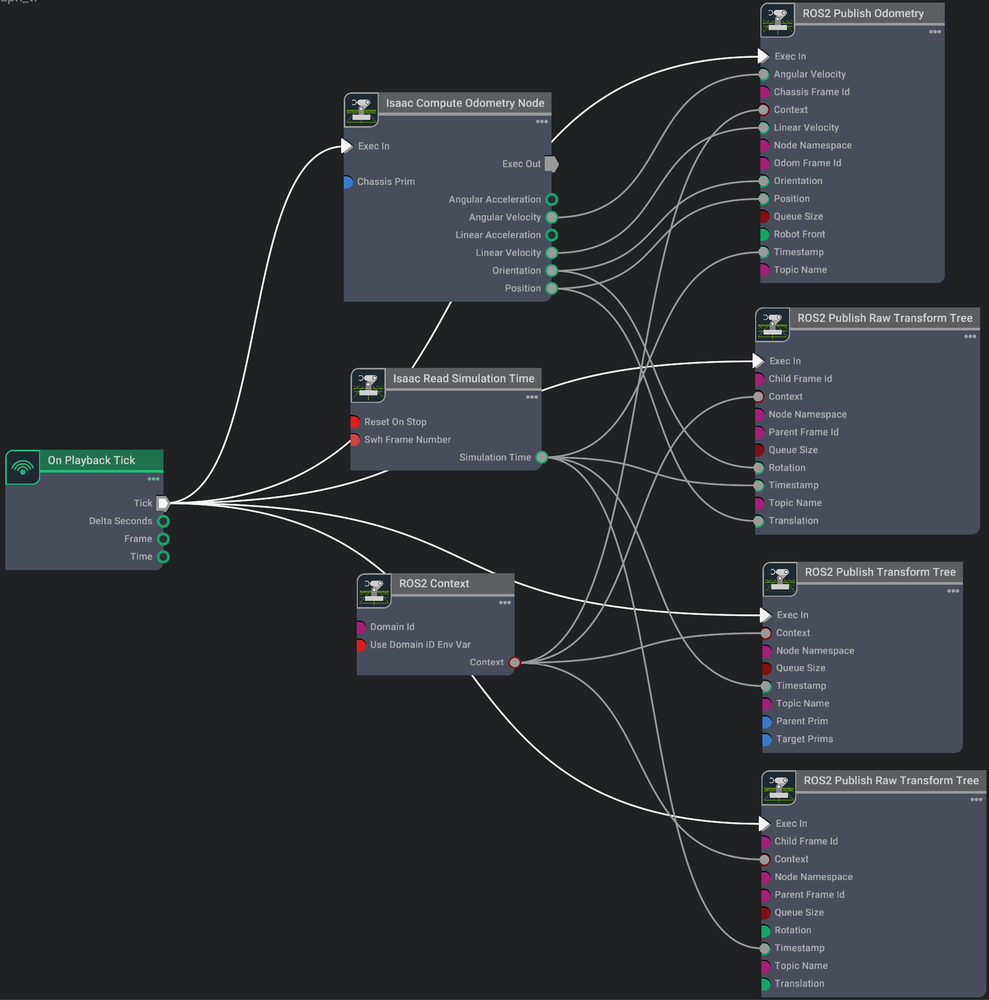

# ROS2 Transform Trees and Odometry

[Reference](https://docs.omniverse.nvidia.com/isaacsim/latest/ros2_tutorials/tutorial_ros2_tf.html)

Assuming you’ve already gone through the ROS2 camera tutorial and have two cameras on stage already, let’s add those cameras to a TF tree, so that we can track the camera’s position in the global frame.



Add two cameras and add to target targetPrims:



run in terminal: `ros2 topic echo /tf`

if you shift and drag around the robot, the values change


**Articulation Transforms**

To get the transforms of each linkage on an articulated robot, add the robot’s articulation root to the targetPrims field. All the linkages subsequent to the articulation root will be published automatically. Add /World/turtlebot3_burger to the targetPrims field, and see that the transforms of all the links of the robot, fixed or articulated, will be published on the /tf topic.


**Publish Relative Transforms**

By default, the transforms are in reference to the `world frame`. You can check that the `/base_link` transform of the Turtlebot is published relative to the /World. If you wish to get the transforms relative to something else, such as a camera, make sure to indicate that in the `parentPrim` field. Add `Camera_1` in the parentPrim field, Stop and Play the simulation between property changes, and you can see that the /base_link transform is now relative to `Camera_1`.

**Setting up Odometry**
To setup odometry for a robot, we would need to publish the odometry ROS message as well as its corresponding transforms.



In the Property tab for the **Isaac Compute Odometry** Node:

- Add the Turtlebot prim (ie. `/World/turtlebot3_burger`) to its Chassis Prim input field. This node calculates the position of the robot relative to its start location. Its output will be fed into both a publisher for the `/odom` Rostopic, and a TF publisher that publishes the singular transform from `/odom` frame to `/base_link` frame.

In the Property tab for the **ROS2 Publish Raw Transform Tree** node:

- Set the childFrameId input field to `base_link`.

- Set the parentFrameId input field to `odom`. This will now enable publishing odom -> base_link frames in the TF tree.

In the Property tab for the **ROS2 Publish Odometry** node:

- Set the chassisFrameId input field to `base_link`.

- Set the odomFrameId input field to `odom`. This will now enable publishing odom -> base_link frames in the TF tree.

At this point we are publishing odometry data and our TF tree only consists of odom -> base_link. We would also like to add the robot articulations under base_link to the TF tree. To do this, add a ROS2 Publish Transform Tree node to the graph and attach the Exec In, Context, and Timestamp fields similarly to previous nodes above.



- In the Property tab for the **ROS2 Publish Transform Tree** node:

 - Set the targetPrims input field to the path to your Turtlebot Prim (ie. `/World/turtlebot3_burger`). Ensure it is identical to the prim path set in the Isaac Compute Odometry Node.

 - Set the parentPrim input field to the path to your base_link inside your Turtlebot Prim (ie. `/World/turtlebot3_burger/base_link`).

Now we should be publishing a TF tree that consists of odom -> base_link -> <other robot links>. This next step is only required when you want to have ground truth localization of the robot. Usually, a ROS package for localization such as Nav2 AMCL would be responsible for setting the transform between a global frame and the odom frame. To setup ground truth localization, add in another ROS2 Publish Raw Transform Tree node to the graph and attach the Exec In, Context, and Timestamp fields similarly to previous nodes above.

- In the Property tab for the recently added ROS2 Publish Raw Transform Tree node:

 - Set the childFrameId input field to odom.

 - Set the parentFrameId input field to world. This will now enable publishing world -> odom frames in the TF tree.

 - Leave Translation and Rotation fields detached as this will use the defaults of (0.0, 0.0, 0.0) translation vector (XYZ) and (1.0, 0.0, 0.0, 0.0) rotation quaternion (IJKR). This rotation and translation corresponds to the robot’s Start pose. If the robot starts in a different position, these fields would have to be updated accordingly to match that pose.



run:

```
ros2 run tf2_tools view_frames
```

A file will be generated: `frames_2024-10-21_13.23.58.pdf`

[Graph Shortcuts](https://docs.omniverse.nvidia.com/isaacsim/latest/ros2_tutorials/tutorial_ros2_tf.html#graph-shortcuts)


## Next Step

[ROS2 Setting Publish Rates](9_doc.md)

## Previous Step

[ROS2 Transform Trees and Odometry](8_doc.md)