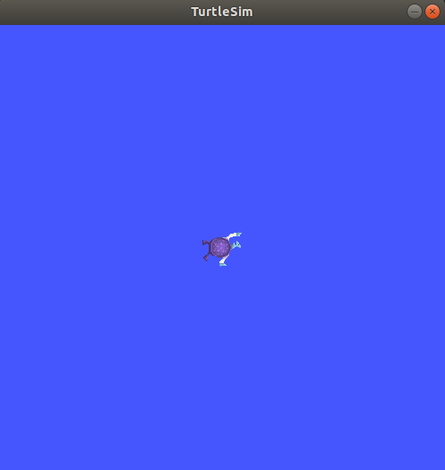
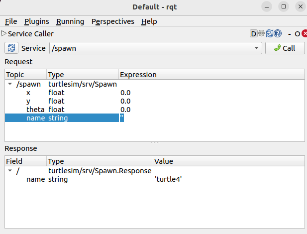
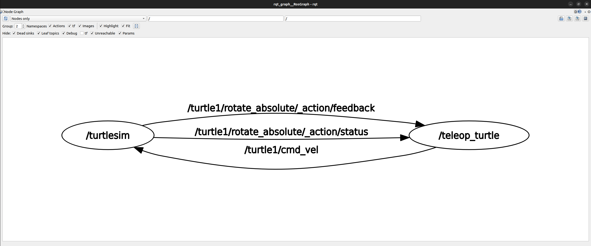
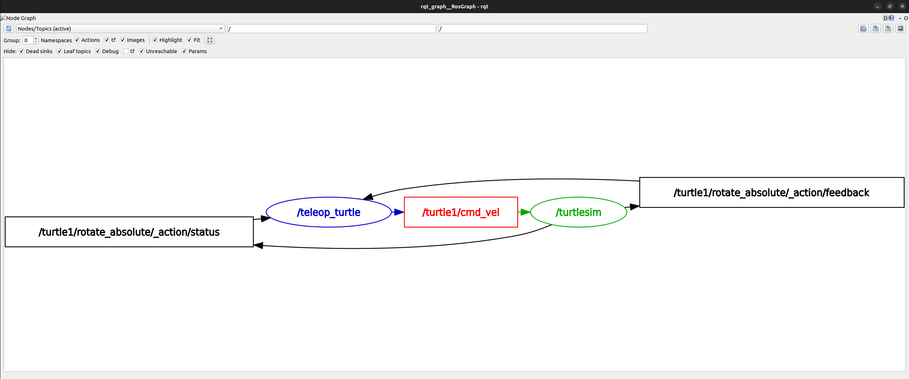
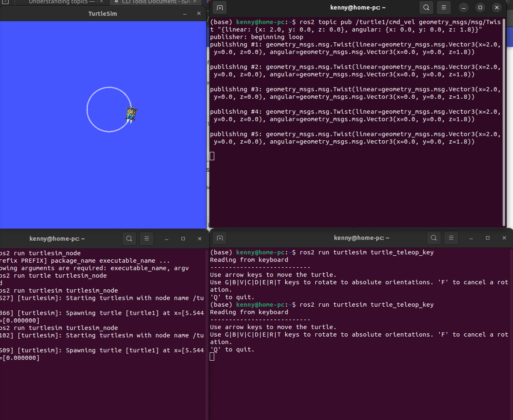
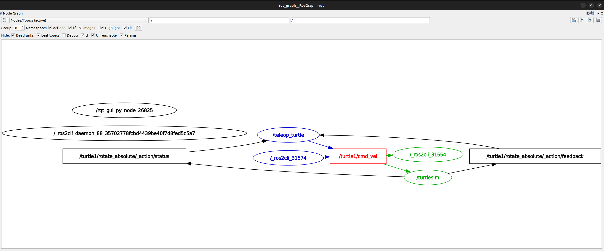
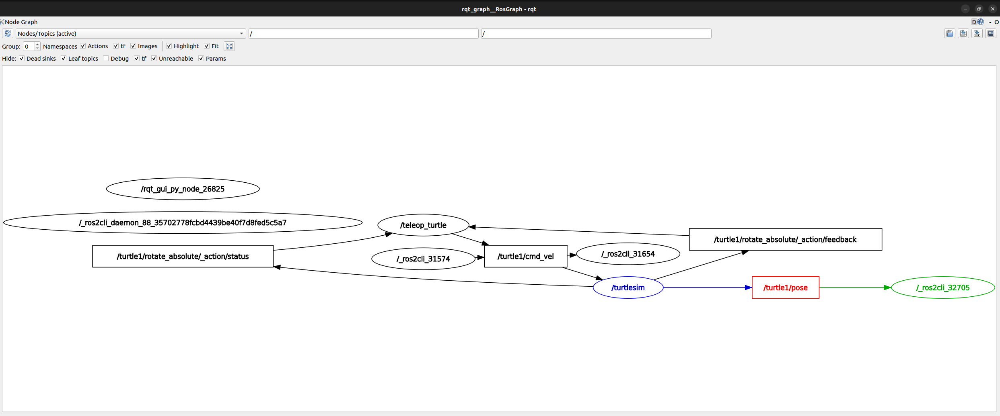

# CLI Tools Document

[Reference](https://docs.ros.org/en/humble/Tutorials/Beginner-CLI-Tools/Configuring-ROS2-Environment.html)

## Configuring environment

[Reference](https://docs.ros.org/en/humble/Tutorials/Beginner-CLI-Tools/Configuring-ROS2-Environment.html#configuring-environment)

### Source the setup files

You will need to run this command on every new shell you open to have access to the ROS 2 commands, like so:

```bash
source /opt/ros/humble/setup.bash
# or below so you don't need to source every time
echo "source /opt/ros/humble/setup.bash" >> ~/.bashrc
```

### Check environment variables

Only after source will these environment variables be set

```bash
printenv | grep -i ROS
```

Check that variables like `ROS_DISTRO` and `ROS_VERSION` are set.

```
ROS_VERSION=2
ROS_PYTHON_VERSION=3
ROS_DISTRO=humble
```

#### The `ROS_DOMAIN_ID` variable

For ROS 2 nodes on the same domain to freely communicate. All ROS 2 notes use domain ID 0 by default. To avoid interference between different groups of computers running ROS 2 on the same network, a different domain ID should be set for each group. Choose a domain ID between 0 and 101, inclusive. For example, `88`

```bash
export ROS_DOMAIN_ID=88
# Or to maintain this setting between shell sessions, add the command to your shell startup script:
echo "export ROS_DOMAIN_ID=88" >> ~/.bashrc
```

#### The `ROS_LOCALHOST_ONLY` variable

`ROS_LOCALHOST_ONLY` allows you to limit ROS 2 communication to localhost only, so that your ROS 2 system, and its topics, services, and actions will not be visible to other computers on the local network.

```bash
export ROS_LOCALHOST_ONLY=1
# Or to maintain this setting between shell sessions, add the command to your shell startup script:
echo "export ROS_LOCALHOST_ONLY=1" >> ~/.bashrc
```

## Using `turtlesim`, `ros2`, and `rpt`

[Reference](https://docs.ros.org/en/humble/Tutorials/Beginner-CLI-Tools/Introducing-Turtlesim/Introducing-Turtlesim.html)

### Concepts

**Turtlesim** is a lightweight simulator for learning ROS 2. It illustrates what ROS 2 does at the most basic level to give you an idea of what you will do with a real robot or a robot simulation later on.

The **ros2 tool** is how the user manages, introspects, and interacts with a ROS system. It supports multiple commands that target different aspects of the system and its operation. One might use it to start a node, set a parameter, listen to a topic, and many more. The **ros2 tool** is part of the core ROS 2 installation.

**rqt** is a graphical user interface (GUI) tool for ROS 2. Everything done in rqt can be done on the command line, but rqt provides a more user-friendly way to manipulate ROS 2 elements.

### Install turtlesim

```bash
sudo apt update
sudo apt install ros-humble-turtlesim
```

Check that the package is installed:

```bash
ros2 pkg executables turtlesim
```

Expected output:

```bash
turtlesim draw_square
turtlesim mimic
turtlesim turtle_teleop_key
turtlesim turtlesim_node
```

### Start turtlesim

```bash
ros2 run turtlesim turtlesim_node
```

What you are expected to see:



```
[INFO] [turtlesim]: Starting turtlesim with node name /turtlesim
[INFO] [turtlesim]: Spawning turtle [turtle1] at x=[5.544445], y=[5.544445], theta=[0.000000]
```

### Use turtlesim

Open another terminal and source ROS 2 again.
```bash
source /opt/ros/humble/setup.bash
```
Run a new node to control the turtle in the first node:
```bash
ros2 run turtlesim turtle_teleop_key
```

You can then use the arrow keys on your keyboard to control the turtle.

**DO NOT CLOSE THE TERMINALS YET for the next section**

### Install rqt

```bash
sudo apt update
sudo apt install '~nros-humble-rqt*'
```

run rqt:
```bash
rqt
```

### Use rqt

select **Plugins** > **Services** > **Service Caller** from the menu bar, you can call different services.


**Plugins** > **Services** > **Service Caller**

#### Try the spawn service

**Select** `/clear` then **Call** can clear the line drawn on turtlesim.

**Select** `/spawn` 

You can double click between the empty single quotes in the Expression column to give value to name, e.g., `Kenny`



You can change `x` and `y` to different value e.g. `1.0` and `1.0` so that the turtle will spawn in different lcoation.

**Click** Call, the turtle will then spawned in the turtlesim window. 

#### Try the set_pen service

Call service `/turtle1/set_pen` and set the pen `color` and `width` then **call** again, the pen color will change.

### Remapping

In order to control `Kenny`. You can remap the `cmd_vel` topic. Create a new terminal, source ROS 2, and run:
```bash
ros2 run turtlesim turtle_teleop_key --ros-args --remap turtle1/cmd_vel:=Kenny/cmd_vel
```

### Close turtlesim

Close the `turtlesim_node` terminal and the `turtle_teleop_key` terminals.

## Understanding nodes

[Reference](https://docs.ros.org/en/humble/Tutorials/Beginner-CLI-Tools/Understanding-ROS2-Nodes/Understanding-ROS2-Nodes.html#understanding-nodes
)

### Background

#### The ROS 2 graph

The ROS graph is a network of ROS 2 elements processing data together at the same time. It encompasses all executables and the connections between them if you were to map them all out and visualize them.

#### Nodes in ROS 2

Each node in ROS should be responsible for a single, modular purpose, e.g. controlling the wheel motors or publishing the sensor data from a laser range-finder. Each node can send and receive data from other nodes via topics, services, actions, or parameters.


### Tasks

#### ros2 run

The command ros2 run launches an executable from a package.

```bash
ros2 run <package_name> <executable_name>
```

To run turtlesim, open a new terminal, and enter the following command in one terminal.

```bash
ros2 run turtlesim turtlesim_node
```

Open another new terminal and start the teleop node with the command:
```bash
ros2 run turtlesim turtle_teleop_key
```

Run the following command to see the node names:

```bash
ros2 node list
```

The terminal should output two active nodes by their names:

```
/teleop_turtle
/turtlesim
```

#### Remapping

Remapping allows you to reassign default node properties, like node name, topic names, service names, etc.,

To open a turtlesim with name `/my_turtle` instead of `/turtlesim`, in a new terminal:

```bash
ros2 run turtlesim turtlesim_node --ros-args --remap __node:=my_turtle
```
A new node named `my_turtle` is created, you can verify using `ros2 node list`.

#### ros2 node info

To access more information about the nodes, e.g., `/my_turtle` node you just created.

```bash
ros2 node info /my_turtle
```
output:
```
/my_turtle
  Subscribers:
    /parameter_events: rcl_interfaces/msg/ParameterEvent
    /turtle1/cmd_vel: geometry_msgs/msg/Twist
  Publishers:
    /parameter_events: rcl_interfaces/msg/ParameterEvent
    /rosout: rcl_interfaces/msg/Log
    /turtle1/color_sensor: turtlesim/msg/Color
    /turtle1/pose: turtlesim/msg/Pose
  Service Servers:
    /clear: std_srvs/srv/Empty
    /kill: turtlesim/srv/Kill
    /my_turtle/describe_parameters: rcl_interfaces/srv/DescribeParameters
    /my_turtle/get_parameter_types: rcl_interfaces/srv/GetParameterTypes
    /my_turtle/get_parameters: rcl_interfaces/srv/GetParameters
    /my_turtle/list_parameters: rcl_interfaces/srv/ListParameters
    /my_turtle/set_parameters: rcl_interfaces/srv/SetParameters
    /my_turtle/set_parameters_atomically: rcl_interfaces/srv/SetParametersAtomically
    /reset: std_srvs/srv/Empty
    /spawn: turtlesim/srv/Spawn
    /turtle1/set_pen: turtlesim/srv/SetPen
    /turtle1/teleport_absolute: turtlesim/srv/TeleportAbsolute
    /turtle1/teleport_relative: turtlesim/srv/TeleportRelative
  Service Clients:

  Action Servers:
    /turtle1/rotate_absolute: turtlesim/action/RotateAbsolute
```
`ros2 node info` returns a list of subscribers, publishers, services, and actions. i.e. the ROS graph connections that interact with that node.

If you have both `/my_turtle` node and `/turtlesim` node opened, then giving arrow commands on the `/teleop_turtle` node moves both two simulators.
ros2 run turtlesim turtle_teleop_key

## Understanding topics

[Reference](https://docs.ros.org/en/humble/Tutorials/Beginner-CLI-Tools/Understanding-ROS2-Topics/Understanding-ROS2-Topics.html)

### Background

ROS 2 breaks complex systems down into many modular nodes. Topics are a vital element of the ROS graph that act as a bus for nodes to exchange messages.


A node may publish data to any number of topics and simultaneously have subscriptions to any number of topics.


Topics are one of the main ways in which data is moved between nodes and therefore between different parts of the system.

### Tasks

#### Setup

Open a new terminal and create `/turtlesim` node:

```bash
ros2 run turtlesim turtlesim_node
```

Open another terminal and create `/teleop_turtle` node:

```bash
ros2 run turtlesim turtle_teleop_key
```

#### rqt_graph

`rqt_graph` is used to visualize the changing nodes and topics, as well as the connections between them. Open a new terminal and enter the command:

```bash
rqt_graph
```
You can also open `rqt_graph` by opening `rqt` and selecting **Plugins** > **Introspection** > **Node Graph**.

You should then see:



Changing Top left corner to `Nodes/Topics (active)` and Groups to `0` so you can see:



It is showing how the `/turtlesim` ndoe and the `/teleop_turtle` node are communicating with each other over the `/turtle1/cmd_vel` topic

#### ros2 topic list

Run the following command to see a list of all the active topics:

```bash
ros2 topic list 
```

output:

```
/parameter_events
/rosout
/turtle1/cmd_vel
/turtle1/color_sensor
/turtle1/pose
```
`ros2 topic list -t` will return the same list of topics, with the **topic type** appended in brackets such as the below output:

```
/parameter_events [rcl_interfaces/msg/ParameterEvent]
/rosout [rcl_interfaces/msg/Log]
/turtle1/cmd_vel [geometry_msgs/msg/Twist]
/turtle1/color_sensor [turtlesim/msg/Color]
/turtle1/pose [turtlesim/msg/Pose]
```

The visualize the topics in the graph, uncheck all the boxes under **Hide**:


For now, though, checked back all those options to avoid confusion.

#### ros2 topic echo

Use `ros2 topic echo <topic_name>` to see the data begin published on a topic, such as:

```bash
ros2 topic echo /turtle1/cmd_vel
```

Now you can move the turtle in turtlesim to see what is being echo-ed in the terminal. Such as below


Now return to rqt_graph and uncheck the **Debug** box under **Hide**.


A new node `/_ros2cli_26814` created by the `echo` command we just ran is subscribed to the `/teleop_turtle` publisher over the `cmd_vel` topic just like `/turtlesim`.

Another wait to look at this is to run the following command

```
ros2 topic info /turtle1/cmd_vel
```

which will return:

```
Type: geometry_msgs/msg/Twist
Publisher count: 1
Subscription count: 2
```

The topic type of `/turtle1/cmd_vel` is `geometry_msgs/msg/Twist` which means that in the package `geometry_msgs` there is a `msg` called `Twist`.

Run `ros2 interface show geometry_msgs/msg/Twist` to learn the details of this type of topics.

It outputs:

```
# This expresses velocity in free space broken into its linear and angular parts.

Vector3  linear
	float64 x
	float64 y
	float64 z
Vector3  angular
	float64 x
	float64 y
	float64 z
```

Which is the same structure as what is echoed in the screenshot above.
This tells you that the `/turtlesim node` is expecting a message with two vectors, `linear` and `angular`, of three elements each. 

#### ros2 topic pub

Now you hcan publish data to a topic directly from the command line using:

```bash
ros2 topic pub <topic_name> <msg_type> '<args>'
```

For exmaple, you can run the below to make the turtle draws a circle

```bash
ros2 topic pub /turtle1/cmd_vel geometry_msgs/msg/Twist "{linear: {x: 2.0, y: 0.0, z: 0.0}, angular: {x: 0.0, y: 0.0, z: 1.8}}"
```

You can see your turtle moving like:



#### ros2 interface show

**Nodes** send data over **topics** using messages. **Publishers** and **Subscribers** must send and receive the same type of message to communicate.

Refresh rqt_graph. Now you can see that the ros2 topic pub 


You can see that another ros2cli node is publishing over the `/turtle1/cmd_vel` topic.

Run `echo` on the `pose` topic and rechecck rqt_graph:

```
ros2 topic echo /turtle1/pose
```

output:

```
---
x: 4.457859516143799
y: 6.952967166900635
theta: -1.8562328815460205
linear_velocity: 2.0
angular_velocity: 1.7999999523162842
---
x: 4.449737071990967
y: 6.922015190124512
theta: -1.8274328708648682
linear_velocity: 2.0
angular_velocity: 1.7999999523162842
---
...
```

rqt Graph:



When publishing messages with timestamps, `pub` has two methods to automatically fill them out with the current time. For messages with a `std_msgs/msg/Header`, the header field can be set to `auto` to fill out the `stamp` field.

```
ros2 topic pub /pose geometry_msgs/msg/PoseStamped '{header: "auto", pose: {position: {x: 1.0, y: 2.0, z: 3.0}}}'
```

If the message does not use a full header, but just has a field with type `builtin_interfaces/msg/Time`, that can be set to the value `now`.

```
ros2 topic pub /reference sensor_msgs/msg/TimeReference '{header: "auto", time_ref: "now", source: "dumy"}'
```

#### ros2 topic hz

For one last introspection on this process, you can view the rate at which data is published using:

```
ros2 topic hz /turtle1/pose
```

It will return data on the rate at which the `/turtlesim` node is publishing data to the `pose` topic.

```
average rate: 59.354
  min: 0.005s max: 0.027s std dev: 0.00284s window: 58
```

Recall that you set the rate of `turtle1/cmd_vel` to publish at a steady 1 Hz using `ros2 topic pub --rate 1`. If you run the above command with `turtle1/cmd_vel` instead of `turtle1/pose`, you will see an average reflecting that rate.

## Understanding services

[Reference](https://docs.ros.org/en/humble/Tutorials/Beginner-CLI-Tools/Understanding-ROS2-Services/Understanding-ROS2-Services.html)

### Background


## Understanding parameters


## Understanding actions


## Using `rqt_console` to view logs


## Launching nodes


## Recording and playing back data


